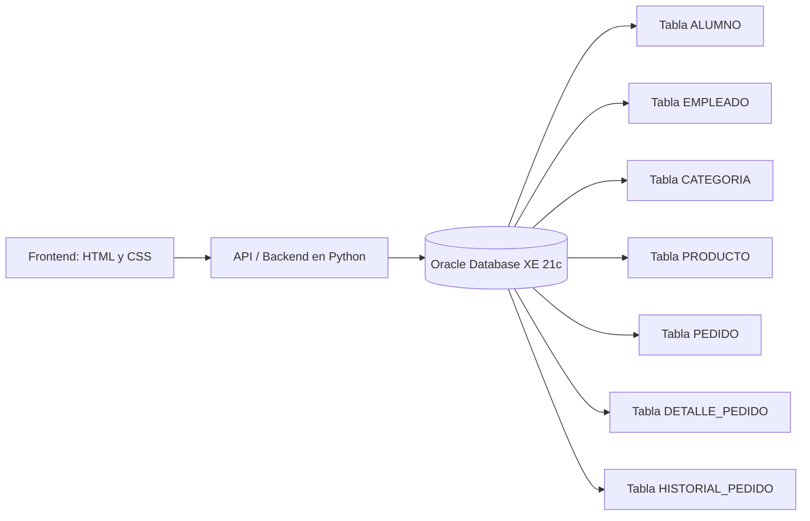
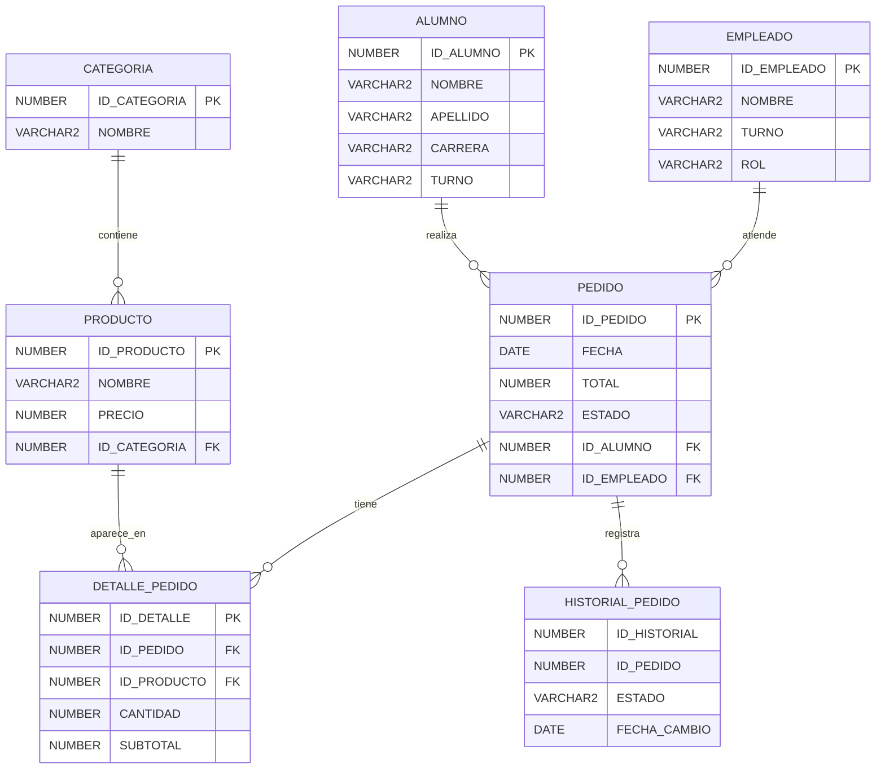
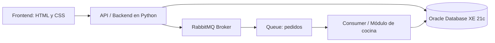
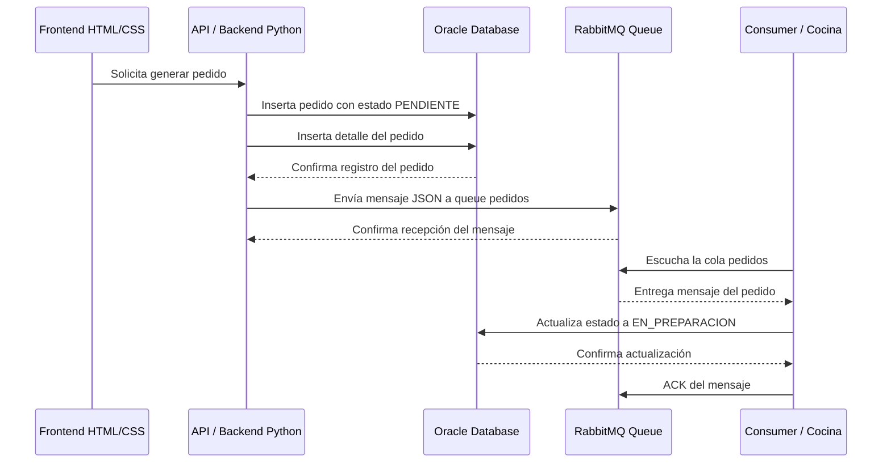

# Cafeteria-Oracle
Realizado por:

-Ramirez Haro Diego Emiliano.

-Caballero Del Valle Alvaro Alejandro.

## 1. Descripción general del proyecto

Este proyecto consiste en el desarrollo de un sistema de pedidos para una cafetería escolar. Inicialmente se diseñó una base de datos relacional en Oracle Database XE 21c para almacenar la información principal del sistema, como alumnos, empleados, productos, categorías, pedidos y detalles de pedidos.

Posteriormente, al proyecto se le agregó RabbitMQ como sistema de cola de mensajes, con la finalidad de simular la comunicación entre el sistema de pedidos y el área de cocina.

El proyecto se divide en dos etapas principales:

```text
1. Diseño e implementación de la base de datos en Oracle.
2. Integración de RabbitMQ para el envío de pedidos hacia cocina.
```

Oracle se encarga de almacenar la información permanente del sistema, mientras que RabbitMQ se utiliza para transportar mensajes entre el módulo que genera pedidos y el módulo de cocina.

---

## 2. Planteamiento del problema

En una cafetería escolar, los pedidos deben registrarse de manera ordenada para evitar pérdida de información, duplicidad de registros o confusión en el estado de cada pedido.

Si el control de pedidos se realiza de forma manual o sin una estructura adecuada, pueden presentarse problemas como:

* Falta de registro claro de los pedidos.
* Dificultad para saber qué alumno realizó un pedido.
* Dificultad para identificar qué productos incluye cada pedido.
* Falta de control sobre el total de la venta.
* Falta de seguimiento del estado del pedido.
* Comunicación poco eficiente entre caja y cocina.

Por esta razón, primero se planteó el diseño de una base de datos que permitiera almacenar correctamente la información del sistema de cafetería.

Después, para mejorar el flujo de comunicación, se agregó RabbitMQ como una cola de mensajes, permitiendo que cuando se genere un pedido, cocina pueda recibir una notificación del mismo.

---

## 3. Objetivo general

Desarrollar un prototipo de sistema de pedidos para una cafetería escolar, utilizando Oracle Database para almacenar la información principal del sistema y RabbitMQ para simular la comunicación entre el módulo de pedidos y el área de cocina mediante colas de mensajes.

---

## 4. Objetivos específicos

* Diseñar una base de datos relacional para una cafetería escolar.
* Crear tablas para alumnos, empleados, productos, categorías, pedidos y detalles de pedidos.
* Implementar llaves primarias, llaves foráneas, restricciones y secuencias en Oracle.
* Registrar pedidos con sus respectivos productos y totales.
* Utilizar un trigger para actualizar automáticamente el total del pedido.
* Plantear una interfaz frontend usando HTML y CSS.
* Utilizar Python como API/backend entre la interfaz, Oracle y RabbitMQ.
* Agregar RabbitMQ como cola de mensajes para enviar pedidos hacia cocina.
* Consumir mensajes desde Python simulando el módulo de cocina.
* Actualizar el estado del pedido cuando cocina recibe el mensaje.

---

## 5. Herramientas generales del proyecto

Para el desarrollo del proyecto se utilizaron herramientas orientadas al manejo de bases de datos, programación e integración de servicios.

La base principal del sistema se trabajó con una base de datos relacional, mientras que la comunicación entre módulos se realizó mediante una cola de mensajes. Además, se utilizó Python como intermediario para conectar la base de datos con el sistema de mensajería.

De forma general, el proyecto considera:

* Una base de datos relacional para almacenar la información del sistema.
* Un backend o API encargado de procesar las operaciones.
* Una interfaz web prevista para la interacción con el usuario.
* Un sistema de mensajería para comunicar el módulo de pedidos con cocina.
* Un repositorio en GitHub para organizar y documentar el proyecto.

---

# Primera etapa: Base de datos en Oracle

## 6. Diseño de la base de datos

La primera parte del proyecto consistió en diseñar la base de datos en Oracle Database XE 21c.

La base de datos permite administrar la información de una cafetería escolar mediante las siguientes entidades:

| Entidad            | Descripción                                                    |
| ------------------ | -------------------------------------------------------------- |
| `CATEGORIA`        | Clasifica los productos de la cafetería.                       |
| `PRODUCTO`         | Almacena los productos disponibles para la venta.              |
| `ALUMNO`           | Registra los alumnos que realizan pedidos.                     |
| `EMPLEADO`         | Registra los empleados que atienden los pedidos.               |
| `PEDIDO`           | Guarda la información general de cada pedido.                  |
| `DETALLE_PEDIDO`   | Guarda los productos incluidos en cada pedido.                 |
| `HISTORIAL_PEDIDO` | Tabla considerada para registrar cambios de estado del pedido. |

---

## 7. Diagrama de arquitectura inicial

Antes de integrar RabbitMQ, el sistema se planteó con una arquitectura básica formada por tres capas principales: frontend, API/backend y base de datos.

Para el frontend se prevé el uso de HTML y CSS, con la finalidad de contar con una interfaz sencilla desde la cual el usuario pueda registrar o consultar pedidos. Esta interfaz se comunicaría con una API desarrollada en Python, la cual sería la encargada de procesar la información y realizar las operaciones correspondientes en Oracle Database.



### Explicación del diagrama

La arquitectura inicial del proyecto se basa en la separación entre la interfaz, la lógica del sistema y el almacenamiento de datos.

El frontend, previsto en HTML y CSS, representa la parte visual del sistema. Desde esta interfaz, el usuario podría registrar pedidos o consultar información de la cafetería.

La API o backend en Python funcionaría como intermediario entre la interfaz y la base de datos. Su función sería recibir los datos enviados desde el frontend, validarlos y ejecutar las operaciones necesarias en Oracle.

Oracle Database XE 21c almacena la información permanente del sistema, incluyendo alumnos, empleados, productos, categorías, pedidos y detalles de pedidos.

El flujo inicial del sistema sería:

```text
Frontend HTML/CSS → API en Python → Oracle Database
```

---

## 8. Modelo entidad-relación



---

## 9. Diccionario de datos

El diccionario de datos se incluye para documentar la estructura de la base de datos. En él se especifica cada tabla, sus campos, tipos de datos, llaves y descripción.

El formato utilizado es:

```text
Campo | Tipo de dato | Llave | Nulo | Descripción
```

---

### 9.1 Tabla `CATEGORIA`

| Campo          | Tipo de dato   | Llave | Nulo | Descripción                          |
| -------------- | -------------- | ----- | ---- | ------------------------------------ |
| `ID_CATEGORIA` | `NUMBER(5)`    | PK    | No   | Identificador único de la categoría. |
| `NOMBRE`       | `VARCHAR2(50)` |       | No   | Nombre de la categoría del producto. |

---

### 9.2 Tabla `PRODUCTO`

| Campo          | Tipo de dato   | Llave | Nulo | Descripción                               |
| -------------- | -------------- | ----- | ---- | ----------------------------------------- |
| `ID_PRODUCTO`  | `NUMBER(5)`    | PK    | No   | Identificador único del producto.         |
| `NOMBRE`       | `VARCHAR2(80)` |       | No   | Nombre del producto.                      |
| `PRECIO`       | `NUMBER(6,2)`  |       | No   | Precio del producto.                      |
| `ID_CATEGORIA` | `NUMBER(5)`    | FK    | No   | Categoría a la que pertenece el producto. |

Restricción aplicada:

```text
PRECIO > 0
```

---

### 9.3 Tabla `ALUMNO`

| Campo       | Tipo de dato   | Llave | Nulo | Descripción                     |
| ----------- | -------------- | ----- | ---- | ------------------------------- |
| `ID_ALUMNO` | `NUMBER(8)`    | PK    | No   | Identificador único del alumno. |
| `NOMBRE`    | `VARCHAR2(60)` |       | No   | Nombre del alumno.              |
| `APELLIDO`  | `VARCHAR2(60)` |       | No   | Apellido del alumno.            |
| `CARRERA`   | `VARCHAR2(80)` |       | Sí   | Carrera del alumno.             |
| `TURNO`     | `VARCHAR2(10)` |       | Sí   | Turno del alumno.               |

Restricción aplicada:

```text
TURNO IN ('MATUTINO','VESPERTINO')
```

---

### 9.4 Tabla `EMPLEADO`

| Campo         | Tipo de dato   | Llave | Nulo | Descripción                              |
| ------------- | -------------- | ----- | ---- | ---------------------------------------- |
| `ID_EMPLEADO` | `NUMBER(5)`    | PK    | No   | Identificador único del empleado.        |
| `NOMBRE`      | `VARCHAR2(60)` |       | No   | Nombre del empleado.                     |
| `TURNO`       | `VARCHAR2(10)` |       | No   | Turno del empleado.                      |
| `ROL`         | `VARCHAR2(30)` |       | Sí   | Rol del empleado dentro de la cafetería. |

Restricciones aplicadas:

```text
TURNO IN ('MATUTINO','VESPERTINO')
ROL IN ('CAJERO','COCINERO','ENCARGADO')
```

---

### 9.5 Tabla `PEDIDO`

| Campo         | Tipo de dato   | Llave | Nulo | Descripción                          |
| ------------- | -------------- | ----- | ---- | ------------------------------------ |
| `ID_PEDIDO`   | `NUMBER(8)`    | PK    | No   | Identificador único del pedido.      |
| `FECHA`       | `DATE`         |       | No   | Fecha en la que se genera el pedido. |
| `TOTAL`       | `NUMBER(8,2)`  |       | No   | Total monetario del pedido.          |
| `ESTADO`      | `VARCHAR2(15)` |       | No   | Estado actual del pedido.            |
| `ID_ALUMNO`   | `NUMBER(8)`    | FK    | No   | Alumno que realizó el pedido.        |
| `ID_EMPLEADO` | `NUMBER(5)`    | FK    | No   | Empleado que registró el pedido.     |

Estados permitidos:

```text
PENDIENTE
EN_PREPARACION
LISTO
ENTREGADO
CANCELADO
```

---

### 9.6 Tabla `DETALLE_PEDIDO`

| Campo         | Tipo de dato  | Llave | Nulo | Descripción                                 |
| ------------- | ------------- | ----- | ---- | ------------------------------------------- |
| `ID_DETALLE`  | `NUMBER(8)`   | PK    | No   | Identificador único del detalle del pedido. |
| `ID_PEDIDO`   | `NUMBER(8)`   | FK    | No   | Pedido al que pertenece el detalle.         |
| `ID_PRODUCTO` | `NUMBER(5)`   | FK    | No   | Producto incluido en el pedido.             |
| `CANTIDAD`    | `NUMBER(3)`   |       | No   | Cantidad solicitada del producto.           |
| `SUBTOTAL`    | `NUMBER(8,2)` |       | No   | Subtotal del producto dentro del pedido.    |

Restricción aplicada:

```text
CANTIDAD >= 1
```

---

### 9.7 Tabla `HISTORIAL_PEDIDO`

| Campo          | Tipo de dato   | Llave | Nulo | Descripción                                      |
| -------------- | -------------- | ----- | ---- | ------------------------------------------------ |
| `ID_HISTORIAL` | `NUMBER(8)`    |       | Sí   | Identificador del registro histórico.            |
| `ID_PEDIDO`    | `NUMBER(8)`    |       | Sí   | Pedido relacionado con el cambio de estado.      |
| `ESTADO`       | `VARCHAR2(20)` |       | Sí   | Estado registrado en el historial.               |
| `FECHA_CAMBIO` | `DATE`         |       | Sí   | Fecha en la que se registró el cambio de estado. |

Esta tabla fue considerada para registrar los cambios de estado de los pedidos, aunque en el prototipo principal la actualización demostrada se realiza directamente sobre la tabla `PEDIDO`.

---

## 10. Elementos implementados en Oracle

La base de datos incluye secuencias, restricciones, llaves primarias, llaves foráneas y un trigger para actualizar el total del pedido.

### 10.1 Secuencias

Se utilizaron secuencias para generar identificadores automáticos:

```sql
seq_categoria
seq_producto
seq_alumno
seq_empleado
seq_pedido
seq_detalle
```

---

### 10.2 Restricciones

Se implementaron restricciones para asegurar la integridad de los datos:

* Llaves primarias.
* Llaves foráneas.
* Restricciones `CHECK`.
* Valores por defecto.
* Campos obligatorios con `NOT NULL`.

---

### 10.3 Trigger para actualizar total

Se creó un trigger para actualizar automáticamente el total del pedido cuando se inserta un registro en `DETALLE_PEDIDO`.

```sql
CREATE OR REPLACE TRIGGER trg_actualizar_total
AFTER INSERT ON DETALLE_PEDIDO
FOR EACH ROW
BEGIN
    UPDATE PEDIDO
    SET TOTAL = TOTAL + :NEW.SUBTOTAL
    WHERE ID_PEDIDO = :NEW.ID_PEDIDO;
END;
/
```

---

## 11. Estados del pedido

El pedido puede manejar los siguientes estados:

| Estado           | Descripción                                                |
| ---------------- | ---------------------------------------------------------- |
| `PENDIENTE`      | El pedido fue registrado en Oracle.                        |
| `EN_PREPARACION` | Cocina recibió el pedido desde RabbitMQ.                   |
| `LISTO`          | Estado planeado para indicar que el pedido está preparado. |
| `ENTREGADO`      | El pedido fue entregado al alumno.                         |
| `CANCELADO`      | El pedido fue cancelado.                                   |

En este prototipo se demuestra principalmente el cambio:

```text
PENDIENTE → EN_PREPARACION
```

Esto representa que el pedido fue creado y posteriormente recibido por cocina.

---

# Segunda etapa: Integración de RabbitMQ

## 12. ¿Por qué se agregó RabbitMQ?

Después de tener la base de datos funcionando, se agregó RabbitMQ para mejorar la comunicación entre el sistema de pedidos y el área de cocina.

La base de datos guarda la información del pedido, pero no funciona como un sistema de mensajería. Por eso se agregó RabbitMQ, para que cuando se registre un nuevo pedido, se mande un aviso a cocina mediante una cola de mensajes.

La idea principal es:

```text
Oracle guarda el pedido.
RabbitMQ transporta el aviso.
Python conecta ambos sistemas.
```

---

## 13. ¿Qué es RabbitMQ?

RabbitMQ es un broker de mensajería. Su función es recibir mensajes, almacenarlos temporalmente en una cola y entregarlos a un consumidor.

En este proyecto, RabbitMQ se utiliza para enviar pedidos hacia cocina.

El flujo básico es:

```text
Producer → RabbitMQ → Queue → Consumer
```

---

## 14. ¿Por qué usar RabbitMQ en el proyecto?

RabbitMQ se utiliza porque permite trabajar con comunicación asíncrona entre partes del sistema.

En una cafetería, cuando se genera un pedido, no es necesario que el sistema de caja o pedidos espere directamente a que cocina lo procese. Lo ideal es que el pedido se registre, se envíe un aviso a cocina y que cocina lo procese cuando reciba el mensaje.

Esto ofrece varias ventajas:

### 14.1 Desacoplamiento entre módulos

El sistema de pedidos y el sistema de cocina no dependen directamente uno del otro. El módulo de pedidos solo envía el mensaje a RabbitMQ, y el módulo de cocina lo recibe desde la cola.

```text
Sistema de pedidos → RabbitMQ → Cocina
```

### 14.2 Comunicación asíncrona

La comunicación asíncrona significa que el productor puede enviar un mensaje sin esperar a que el consumidor lo procese inmediatamente.

En este caso, el pedido puede quedar en RabbitMQ hasta que el módulo de cocina lo reciba.

### 14.3 Mejor control del flujo de pedidos

RabbitMQ permite visualizar si hay mensajes pendientes en la cola. Si cocina no ha recibido un pedido, el mensaje permanece en la cola. Cuando cocina lo recibe y confirma su procesamiento, RabbitMQ elimina el mensaje de la cola.

### 14.4 Separación entre almacenamiento y mensajería

Oracle y RabbitMQ no cumplen la misma función.

```text
Oracle almacena los datos permanentes del pedido.
RabbitMQ transporta el mensaje hacia cocina.
```

Frase clave:

```text
RabbitMQ transporta el mensaje; Oracle conserva el estado real del pedido.
```

---

## 15. Requisitos para la instalación

Para instalar y utilizar RabbitMQ dentro del proyecto se necesitaron los siguientes elementos:

| Requisito              | Descripción                                         |
| ---------------------- | --------------------------------------------------- |
| Windows                | Sistema operativo utilizado durante la instalación. |
| Erlang OTP 27.3.4.13   | Plataforma necesaria para ejecutar RabbitMQ.        |
| RabbitMQ Server 4.1.8  | Broker de mensajería utilizado en el proyecto.      |
| Python 3.13            | Lenguaje usado para conectar Oracle con RabbitMQ.   |
| Oracle Database XE 21c | Base de datos del proyecto.                         |
| SQL Developer          | Herramienta para administrar Oracle.                |

---

## 16. Proceso de descarga e instalación de RabbitMQ

### 16.1 Instalación de Erlang

Primero se instaló Erlang OTP, ya que RabbitMQ depende de Erlang para ejecutarse.

Durante la instalación se dejaron seleccionados los componentes por defecto:

```text
Erlang
Development
Associations
Erlang Documentation
```

Después de instalar Erlang, se verificó desde la terminal con el comando:

```cmd
erl
```

También fue necesario agregar Erlang al PATH de Windows, ya que inicialmente el comando `erl` no era reconocido por la terminal.

Ruta agregada al PATH:

```text
C:\Program Files\Erlang OTP\bin
```

Variable de entorno utilizada:

```text
ERLANG_HOME = C:\Program Files\Erlang OTP
```

Después de cerrar y abrir nuevamente la terminal, el comando `erl` funcionó correctamente.

---

### 16.2 Instalación de RabbitMQ

Después de instalar Erlang, se instaló RabbitMQ Server 4.1.8.

Durante la instalación de RabbitMQ se seleccionaron los componentes:

```text
RabbitMQ Server
RabbitMQ Service
Start Menu Shortcuts
```

Durante el proceso se presentó el error:

```text
rabbitmq-service.bat start exited with code 1
```

Esto indicaba que RabbitMQ se había instalado, pero el servicio de Windows no pudo iniciarse correctamente.

Para solucionarlo, se verificó que no quedaran servicios antiguos registrados. En caso de que el servicio RabbitMQ siguiera registrado en Windows, se utilizó:

```cmd
sc delete RabbitMQ
```

Después se ejecutó RabbitMQ de forma manual desde la carpeta de instalación:

```cmd
cd "C:\Program Files\RabbitMQ Server\rabbitmq_server-4.1.8\sbin"
rabbitmq-server.bat
```

De esta forma, RabbitMQ pudo ejecutarse manualmente sin depender del servicio de Windows.

---

### 16.3 Activación del panel de administración

RabbitMQ cuenta con un panel web que permite administrar colas, conexiones, usuarios y mensajes.

Para activar el panel web se ejecutó:

```cmd
rabbitmq-plugins.bat enable rabbitmq_management --offline
```

El sistema confirmó que se habilitaron los siguientes plugins:

```text
rabbitmq_management
rabbitmq_management_agent
rabbitmq_web_dispatch
```

Después de iniciar RabbitMQ, se pudo acceder al panel web desde el navegador con la dirección:

```text
http://localhost:15672
```

Credenciales por defecto:

```text
Usuario: guest
Contraseña: guest
```

---

### 16.4 Creación de la cola de mensajes

Una vez dentro del panel de administración de RabbitMQ, se creó la cola que se usaría para el proyecto.

Datos de la cola:

```text
Virtual host: /
Nombre de la cola: pedidos
Durabilidad: Durable
```

Se decidió usar el nombre en minúsculas:

```text
pedidos
```

Esto se hizo para evitar errores, ya que RabbitMQ distingue entre mayúsculas y minúsculas.

Por ejemplo:

```text
pedidos
```

y

```text
Pedidos
```

serían consideradas colas diferentes.

---

## 17. Datos de configuración de RabbitMQ

| Elemento            | Valor                    |
| ------------------- | ------------------------ |
| Broker / MQ         | RabbitMQ 4.1.8           |
| Erlang              | Erlang OTP 27.3.4.13     |
| Host                | `localhost`              |
| Usuario             | `guest`                  |
| Contraseña          | `guest`                  |
| Virtual host        | `/`                      |
| Puerto AMQP         | `5672`                   |
| Puerto Manager      | `15672`                  |
| URL Manager         | `http://localhost:15672` |
| Queue               | `pedidos`                |
| Formato del mensaje | JSON                     |

---

## 18. Puertos utilizados

RabbitMQ utiliza diferentes puertos porque cada uno cumple una función específica.

| Puerto  | Función                                                                  |
| ------- | ------------------------------------------------------------------------ |
| `5672`  | Puerto AMQP utilizado por Python para enviar y recibir mensajes.         |
| `15672` | Puerto del panel web de administración de RabbitMQ.                      |
| `4369`  | Puerto interno utilizado por Erlang.                                     |
| `25672` | Puerto interno utilizado por RabbitMQ/Erlang para comunicación del nodo. |

En el proyecto se utilizan principalmente:

```text
5672  → Comunicación entre Python y RabbitMQ
15672 → Acceso al panel web de administración
```

El puerto `5672` es el que usa Python mediante la librería `pika` para conectarse a RabbitMQ.

Ejemplo:

```python
pika.ConnectionParameters(
    host="localhost",
    port=5672
)
```

El puerto `15672` se utiliza únicamente para acceder al panel web de administración desde el navegador:

```text
http://localhost:15672
```

---

## 19. Writer, MQ y Reader

### 19.1 Writer / Producer

El writer o producer es el programa que genera y envía el mensaje a RabbitMQ.

En este proyecto es:

```text
producer_pedido.py
```

Este script realiza las siguientes acciones:

```text
1. Se conecta a Oracle.
2. Crea un pedido con estado PENDIENTE.
3. Inserta los detalles del pedido.
4. Envía un mensaje JSON a RabbitMQ.
5. Coloca el mensaje en la cola pedidos.
```

---

### 19.2 MQ

MQ significa Message Queue, es decir, cola de mensajes.

En este proyecto, RabbitMQ funciona como el MQ porque almacena temporalmente el mensaje del pedido en la cola `pedidos`.

---

### 19.3 Reader / Consumer

El reader o consumer es el programa que lee el mensaje desde RabbitMQ.

En este proyecto es:

```text
consumer_cocina.py
```

Este script realiza las siguientes acciones:

```text
1. Escucha la cola pedidos.
2. Recibe el mensaje del pedido.
3. Muestra la información del pedido.
4. Actualiza en Oracle el estado del pedido a EN_PREPARACION.
5. Confirma a RabbitMQ que el mensaje fue consumido.
```

---

## 20. Formato del mensaje

RabbitMQ permite enviar mensajes en diferentes formatos, como texto plano, XML o JSON.

En este proyecto se utilizó JSON, ya que permite enviar datos estructurados de forma clara y es fácil de manejar desde Python.

Ejemplo de mensaje JSON:

```json
{
    "id_pedido": 5,
    "estado": "PENDIENTE",
    "total": 46.0,
    "productos": [
        {
            "producto": "Cafe",
            "cantidad": 1,
            "precio": 18.0,
            "subtotal": 18.0
        },
        {
            "producto": "Taco de guisado",
            "cantidad": 2,
            "precio": 14.0,
            "subtotal": 28.0
        }
    ]
}
```

---

## 21. Pub/Sub

RabbitMQ también permite trabajar con el modelo Pub/Sub, que significa Publish/Subscribe.

En este modelo, un mensaje puede ser publicado una vez y recibido por varios consumidores o suscriptores.

Ejemplo:

```text
Pedido listo
    ↓
Pantalla de pedidos
Caja
Alumno
Cocina
```

Esto sería útil en una versión más completa del sistema, donde un evento como “pedido listo” podría notificarse a varios módulos al mismo tiempo.

Sin embargo, en este prototipo se utilizó una cola directa, ya que el objetivo era que cada pedido fuera recibido por el módulo de cocina una sola vez.

El modelo usado fue:

```text
Producer → Queue → Consumer
```

Aunque RabbitMQ permite Pub/Sub mediante exchanges, para este proyecto se eligió una cola simple porque cada pedido debe ser procesado una vez por cocina.

---

## 22. Diagrama de arquitectura con RabbitMQ

Después de tener planteada la base de datos y la comunicación entre frontend, API y Oracle, se agregó RabbitMQ para mejorar el flujo de comunicación entre el sistema de pedidos y el módulo de cocina.



### Explicación del diagrama

En esta segunda etapa, el frontend seguiría funcionando como la interfaz visual del sistema, mientras que la API en Python se encarga de conectar con Oracle y RabbitMQ.

Cuando se genera un pedido, la API registra primero la información en Oracle con estado `PENDIENTE`. Después, la misma API envía un mensaje en formato JSON a RabbitMQ, el cual se almacena en la cola `pedidos`.

Posteriormente, el consumer que representa al módulo de cocina lee el mensaje desde RabbitMQ y actualiza el estado del pedido en Oracle a `EN_PREPARACION`.

El flujo final queda de la siguiente manera:

```text
Frontend HTML/CSS
        ↓
API en Python
   ↓            ↓
Oracle      RabbitMQ
                ↓
          Queue pedidos
                ↓
       Consumer cocina
                ↓
             Oracle
```

Con esta arquitectura, Oracle conserva la información real del pedido, mientras que RabbitMQ se encarga de transportar el aviso hacia cocina.

---

## 23. Diagrama de secuencia



---

## 24. Flujo final del sistema

```text
1. Se crea un pedido desde el sistema.
2. La API registra el pedido en Oracle.
3. El pedido queda con estado PENDIENTE.
4. Python envía un mensaje JSON a RabbitMQ.
5. RabbitMQ guarda el mensaje en la cola pedidos.
6. Cocina recibe el mensaje mediante el consumer.
7. Oracle actualiza el pedido a EN_PREPARACION.
```

Frase clave:

```text
RabbitMQ transporta el mensaje; Oracle conserva el estado real del pedido.
```

---

## 25. Estructura del proyecto

```text
cafeteria-rabbitmq-oracle/
│
├── DB/
│   └── cafeteria_local.sql
│
└── API/
    ├── producer_pedido.py
    ├── consumer_cocina.py
    ├── test_oracle.py
    └── test_rabbit.py

```

---

## 26. Instalación de dependencias de Python

Para instalar las librerías necesarias de Python:

```bash
py -m pip install -r requirements.txt
```

Contenido de `requirements.txt`:

```text
oracledb
pika
```

---

## 27. Configuración de conexión

### 27.1 Oracle

Datos utilizados para la conexión con Oracle:

```text
Usuario: cafeteria
DSN: localhost:1521/XE
```

En los archivos Python se debe colocar la contraseña correspondiente del usuario Oracle.

Por seguridad, no se recomienda subir contraseñas reales al repositorio.

Ejemplo:

```python
ORACLE_USER = "cafeteria"
ORACLE_PASSWORD = "TU_PASSWORD"
ORACLE_DSN = "localhost:1521/XE"
```

---

### 27.2 RabbitMQ

Datos utilizados para la conexión con RabbitMQ:

```text
Host: localhost
Puerto: 5672
Usuario: guest
Contraseña: guest
Virtual host: /
Queue: pedidos
```

---

## 28. Ejecución del proyecto

### 28.1 Iniciar RabbitMQ

RabbitMQ debe estar ejecutándose antes de probar los scripts.

En Windows puede iniciarse manualmente desde la carpeta `sbin`:

```cmd
rabbitmq-server.bat
```

Después se puede acceder al panel de administración desde:

```text
http://localhost:15672
```

Credenciales:

```text
Usuario: guest
Contraseña: guest
```

---

### 28.2 Ejecutar consumidor

Primero se ejecuta el consumidor de cocina:

```cmd
py api/consumer_cocina.py
```

Este script queda escuchando la cola `pedidos`.

---

### 28.3 Ejecutar productor

Después, en otra terminal, se ejecuta el productor:

```cmd
py api/producer_pedido.py
```

Este script crea un pedido en Oracle y envía el mensaje a RabbitMQ.

---

## 29. Pruebas realizadas

Durante el desarrollo se realizaron pruebas separadas para comprobar cada parte del sistema.

### 29.1 Prueba de conexión con RabbitMQ

Se probó que Python pudiera conectarse con RabbitMQ y enviar un mensaje a la cola `pedidos`.

Resultado:

```text
Mensaje enviado correctamente a la cola 'pedidos'.
```

---

### 29.2 Prueba de conexión con Oracle

Se probó que Python pudiera conectarse con Oracle utilizando el usuario `cafeteria`.

DSN funcional:

```text
localhost:1521/XE
```

---

### 29.3 Prueba de integración completa

Se ejecutó primero el consumer y después el producer.

El producer realizó lo siguiente:

```text
1. Creó un pedido en Oracle.
2. Lo registró con estado PENDIENTE.
3. Envió un mensaje JSON a RabbitMQ.
```

El consumer realizó lo siguiente:

```text
1. Recibió el mensaje desde la cola pedidos.
2. Mostró la información del pedido.
3. Actualizó el estado del pedido en Oracle a EN_PREPARACION.
```

---

## 30. Resultado obtenido

Se logró integrar Oracle Database, Python y RabbitMQ de forma funcional.

Durante las pruebas se comprobó que:

* Python se conecta correctamente a Oracle.
* Python se conecta correctamente a RabbitMQ.
* El producer crea un pedido en Oracle.
* El producer envía el mensaje a la cola `pedidos`.
* El consumer recibe el mensaje desde RabbitMQ.
* El estado del pedido se actualiza en Oracle de `PENDIENTE` a `EN_PREPARACION`.

Con esto se cumple el objetivo del prototipo: demostrar cómo una base de datos Oracle puede complementarse con RabbitMQ para mejorar la comunicación entre módulos de un sistema.

---

## 31. Conclusión

El proyecto permitió construir una base de datos funcional para una cafetería escolar e integrarla con RabbitMQ mediante Python.

La primera etapa se enfocó en el diseño y construcción de la base de datos en Oracle, donde se almacenan alumnos, empleados, productos, pedidos y detalles de pedidos.

La segunda etapa agregó RabbitMQ como una cola de mensajes para simular la comunicación entre el sistema de pedidos y cocina.

El resultado final demuestra que RabbitMQ no reemplaza a la base de datos, sino que la complementa. Oracle conserva la información real y permanente del pedido, mientras que RabbitMQ transporta el mensaje para que cocina pueda recibirlo y procesarlo.

La frase principal del funcionamiento del sistema es:

```text
Oracle guarda la información; RabbitMQ comunica los eventos.
```
